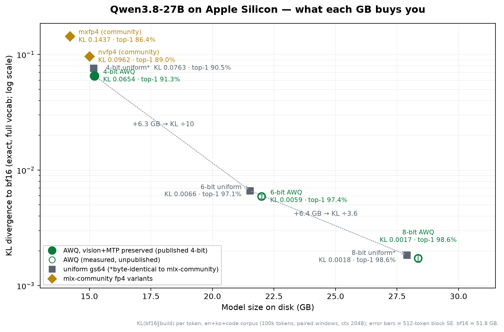

# The tier chart: exact KL vs size, ours and the community's

Inspired by AtomicChat's size-quality Pareto chart for GGUF quants, this is the
same idea for Qwen3.8-27B on MLX, measured the strict way: **exact full-vocab
KL divergence to bf16** (248,320-way softmax in fp32, no top-K truncation), on
paired non-overlapping ctx-2048 windows over a 100K-token en+ko+code corpus,
with 512-token block standard errors. AtomicChat used ctx 4096; I use 2048 to
match the PPL protocol elsewhere in this repo. Raw JSONs are in
[results/kl_out/](../results/kl_out/), the harness is
[harness/kl_eval.py](../harness/kl_eval.py), and the chart is generated by
[harness/make_tier_chart.py](../harness/make_tier_chart.py).

## The table

| build | GB | KL to bf16 (overall) | top-1 agree | decode tok/s | notes |
|---|---:|---:|---:|---:|---|
| bf16 (reference) | 51.8 | 0 | 100% | 12.6 | |
| 8-bit AWQ | 28.36 | **0.00172** | 98.62% | — | measured, unpublished |
| **8-bit uniform** (published) | 27.90 | 0.00184 | 98.55% | 21.8 | byte-identical to mlx-community 8-bit |
| 6-bit AWQ | 22.00 | **0.00591** | 97.41% | — | measured, unpublished |
| **6-bit uniform** (published) | 21.53 | 0.00664 | 97.14% | 27.3 | |
| **4-bit AWQ** (published) | 15.21 | **0.06536** | 91.27% | 37.7 | vision+MTP preserved |
| 4-bit uniform | 15.17 | 0.07626 | 90.54% | 37.5 | byte-identical to mlx-community 4-bit |
| nvfp4 (mlx-community) | 15.01 | 0.09621 | 88.99% | — | |
| mxfp4 (mlx-community) | 14.21 | 0.14374 | 86.38% | — | |

Per-slice numbers (en/ko/code with block SEs) are in the JSONs; every
comparison above is a paired measurement over identical token windows.

## What the chart says

1. **The 4→6-bit step is the steep one.** +6.3 GB divides KL by ~10 (0.0654 →
   0.0066) and takes top-1 agreement from 91% to 97%. The 6→8-bit step buys
   another ÷3.6 but you are already deep in diminishing returns. If your Mac
   fits the 6-bit build with your context budget, that is the value tier.
2. **AWQ beats uniform at every bit width, at ~2-3% size cost.** At 4-bit the
   gap is the largest and is why the published 4-bit is AWQ: KL −14.3%
   (0.0763 → 0.0654), top-1 +0.73 pp, with the biggest slice gain on English
   (−21%) and Korean (−17%). At 6-bit AWQ is −11% KL, at 8-bit the two are
   within noise on en/code but AWQ is significantly better on Korean
   (0.00124 vs 0.00169). The published 6/8-bit builds stay uniform for now;
   the AWQ six/eight measurements are recorded here in case that call changes.
3. **The fp4 variants are dominated at this size point.** nvfp4 costs
   essentially the same disk as affine 4-bit gs64 (15.0 vs 15.2 GB) yet lands
   at 1.26× the KL of uniform and 1.47× the KL of the published AWQ build;
   mxfp4 saves 1 GB and roughly doubles the AWQ build's KL. fp4 formats exist
   for hardware with native fp4 matmul units; on M3-class Apple silicon there
   is no such unit to please, so affine int4 + AWQ strictly wins the
   quality-per-GB race.

## The accidental cross-validation

The community 4-bit and 8-bit rows produced KL numbers identical to my uniform
builds to five decimal places. That looked suspicious, so I compared weights
directly: **byte-identical** (lm_head plus 10/10 randomly sampled tensors, both
tiers). Affine gs64 quantization in mlx-lm is deterministic, and both pipelines
started from the same bf16 release, so this is expected in hindsight — but it
is also a free end-to-end cross-check: two independently produced artifacts,
measured through my whole chain, landed on the same numbers. It also means the
chart's "uniform" points *are* the community baseline (minus the vision tower
and MTP head their conversion drops), so the AWQ-vs-uniform comparison doubles
as published-mine-vs-published-theirs without any theater.

## Choosing a tier on a real Mac

Disk size is not the budget that matters — resident weights + KV cache +
runtime overhead is. KV for this model runs ≈1 GB per 8K tokens of context
(fp16; the repo's KV-quant notes apply beyond ~32K). Rules of thumb:

- **32 GB Mac**: 4-bit AWQ (15.2 GB) with generous context, or 6-bit
  (21.5 GB) with a modest one. mxfp4's 1 GB saving does not change what fits
  anywhere — that is why it is dominated.
- **48 GB Mac**: 6-bit with long context, or 8-bit with a normal one.
- **64 GB+ Mac**: 8-bit (27.9 GB) with room to spare; past that you are
  buying KL ÷3.6 for zero perceived difference in most use — corpus PPL could
  not statistically separate 8-bit from bf16 in this repo's paired protocol.

## Caveats

- KL to bf16 is a fidelity metric, not a capability benchmark; it tells you
  how faithfully a build reproduces the reference distribution, not whether
  the reference was right. It is, however, monotone with every downstream
  proxy I measured here (probe top-1, corpus PPL ordering).
- The fp4 measurements ran with the fork's split-K kernel disabled
  (`MLXLM_NO_FAST_QMM=1`) after the kernel patch crashed on non-affine layers
  (since fixed with a fallback); the KL windows are prefill-shaped (M=2048),
  far outside the kernel's M∈[6,8] window, so this is measurement-neutral.
- Decode tok/s in the table is the plain-decode figure from `results/m_*.json`
  (dependency-chained, EOS-cut, thermal-alternated protocol); speculative
  multipliers on top of it are in [speculative.md](speculative.md).
